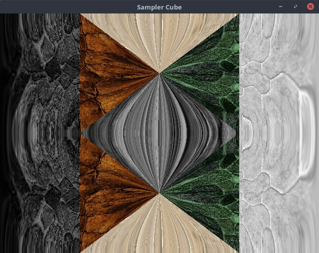

# GLA - openGL Assistant

#LICENSE
MIT License

Copyright (c) [2016] [Gavin Lobo]

Permission is hereby granted, free of charge, to any person obtaining a copy
of this software and associated documentation files (the "Software"), to deal
in the Software without restriction, including without limitation the rights
to use, copy, modify, merge, publish, distribute, sublicense, and/or sell
copies of the Software, and to permit persons to whom the Software is
furnished to do so, subject to the following conditions:

The above copyright notice and this permission notice shall be included in all
copies or substantial portions of the Software.

THE SOFTWARE IS PROVIDED "AS IS", WITHOUT WARRANTY OF ANY KIND, EXPRESS OR
IMPLIED, INCLUDING BUT NOT LIMITED TO THE WARRANTIES OF MERCHANTABILITY,
FITNESS FOR A PARTICULAR PURPOSE AND NONINFRINGEMENT. IN NO EVENT SHALL THE
AUTHORS OR COPYRIGHT HOLDERS BE LIABLE FOR ANY CLAIM, DAMAGES OR OTHER
LIABILITY, WHETHER IN AN ACTION OF CONTRACT, TORT OR OTHERWISE, ARISING FROM,
OUT OF OR IN CONNECTION WITH THE SOFTWARE OR THE USE OR OTHER DEALINGS IN THE
SOFTWARE.


# What is GLA?
GLA is a header-only C++ wrapper to work with OpenGL objects.  It provides
easy to user interfaces into OpenGL buffers, samplers, sampler_arrays,
framebufferobjects, uniformbuffers and a few other things.

GLA is not a rendering or game engine. But it can be used to create
a rendering engine! It exists on the level above OpenGL but below
the rendering engine.

# Dependencies
The only dependency that this library uses is GLM, which provides

[GLM](https://github.com/g-truc/glm) - Required

[GLFW](http://www.glfw.org/) - for examples only

# Features

This library provides many "Core" features which are only used to work
with raw OpenGL objects. The interfaces it provides are typesafe so it
does not allow you to pass inappropriate data to the OpenGL driver.

## Core Features

* Classes:
  * Transforms
  * Cameras
  * Timers
  * Images
  * Simple Geometry (boxes, spheres, etc)
* OpenGL Classes:
  * Shaders
  * Buffers
  * ArrayBuffers
  * ArrayElementBuffers
  * UniformBuffers
  * FrameBuffers
  * Sampler2D
  * Sampler2DArray
  * More coming soon.


## Engine Features
The "eng" namespace provides some extra features built on top of the core library. It is my
intention to provide some higher functionality objects that most common rendering engines.

* Classes
  * MeshBuffer   - provides a conveneint way to store many meshes in a single buffer
  * TextureAtlas - provides a virtual texture mechanism (coming soon)


# Code Snippets

## Image Loading

```C++
// Load an image from from disk
gla::Image Img;
Img.loadFromPath("./resources/textures/rocks1024.jpg");

// Copy it into a Sampler2D object which exists on the GPU
Sampler2D Sampler(Img);

```

## Image Manipulation

```C++
// Load an image from from disk
gla::Image Img;
Img.loadFromPath("./resources/textures/rocks1024.jpg");

// Add the blue and green channel and store it in the red channel
Img.r = Img.b + Img.g

// Use a function to modify the blue channel
Img.b = IMAGE_EXPRESSION( glm::clamp(2*x + y,0.0f,1.0f) );

```


## Examples

GLA Comes with a set of examples to get you started.

### Hello Triangle


The very basic OpenGL example. This example shows you how to open a window,
compile the shaders, initialize the vertex buffers and raw the triangle onto the
screen.

---

### Hello Textured Triangle


Take the Hello Triangle example and provide a texture to it. This example shows
you how to load an image from disk, manipulate it on the cpu, pass it to
the GPU as a sampler and then apply the texture to a primative.

---

### Sampler Cube



Create a sampler cube and apply it to a texture. Sampler cubes can be used or
various things such as sky boxes and point shadows. This example loads 6 images
onto each side of the sampler cube and applies that to a flat texture to
demonstrate the mapping of a sampler cube.

---

### Uniform Buffers


Uniform buffers are used to pass data to your shader. This example uses a
uniform buffer to pass in a velocity value to change the direction of the noise
on the texture.

---

### Frame Buffers and Rendering to Textures


Render an object to a texture and then use that texture on another object. This technique is the basis for Deferred Rendering and Shadow Mapping.

---

### Mesh Buffers


Mesh Buffers are not an OpenGL entity. It is designed for GLA. A Mesh Buffer
stores multiple full meshes in a single buffer. Doing this reduces the overhead
of binding different buffers during the rendering phase which allows for a
perfomance increase.

---

### Shdows


The shadow mapping examples demonstrate how to use shadow maps as well as filters to create soft shadows. It includes point shadows which project omnidirectional shadows (point sources of light) as well as directional shadows (spot lights)

---
